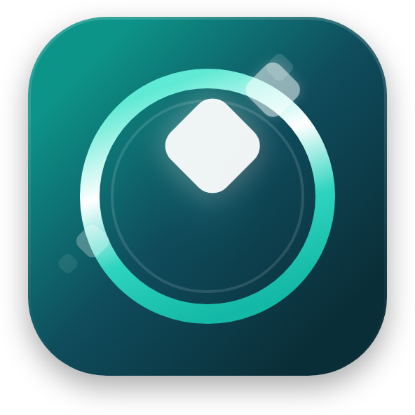

  

<h1 align="center">ClipMemory</h1>

  <strong>A modern clipboard manager for Windows 11</strong>

  
  
  
  

  <a href="README.ko.md">🇰🇷 한국어</a>

---

## About

ClipMemory is a lightweight clipboard manager that lives in your system tray. It automatically captures everything you copy — text, images, files, and more — and lets you access, search, and reuse your clipboard history instantly.

Built with WinUI 3 for a native Windows 11 experience.

## Features

- **Clipboard History** — Automatically saves text, images, files, and rich content
- **Strip Card UI** — Visual card-based interface for quick browsing
- **Pin & Favorites** — Keep important items always accessible
- **Tags & Search** — Organize and find clips with tags and full-text search
- **Drag & Drop** — Drag any clip directly into other apps
- **Multi-format Support** — Text, RTF, HTML, images, file lists, and more
- **OCR** — Extract text from images (powered by Windows OCR)
- **Paste Stack** — Queue multiple items and paste them in sequence
- **Rules Engine** — Auto-tag or auto-pin clips based on custom rules
- **Keyboard Shortcuts** — Global hotkeys for quick access
- **Auto-update** — Seamless background updates via Velopack

## Screenshots

<!-- TODO: Add screenshots -->
<!--

  

-->

## Installation

### Installer (Recommended)

1. Download **`ClipMemory-win-Setup.exe`** from the [latest release](https://github.com/bitleader-dev/ClipMemory-releases/releases/latest)
2. Run the installer — no admin required
3. ClipMemory installs to `%LocalAppData%\ClipMemory\` and creates shortcuts on Desktop and Start Menu

### Portable

1. Download **`ClipMemory-win-Portable.zip`** from the [latest release](https://github.com/bitleader-dev/ClipMemory-releases/releases/latest)
2. Extract to any folder
3. Run `ClipMemory.exe`

> **Note:** The portable version does not support auto-updates.

<!--
### Microsoft Store

-->

## System Requirements

- Windows 11 22H2 or later (Build 22621+)
- x64 processor
- ~150 MB disk space

## Uninstall

- **Installer version**: Settings > Apps > Installed apps > ClipMemory > Uninstall
- **Portable version**: Simply delete the folder

App data is stored in `%LocalAppData%\ClipMemory\` — delete this folder to remove all settings and history.

## Support

Found a bug or have a feature request? Please open an [issue](https://github.com/bitleader-dev/ClipMemory-releases/issues).

## Legal

- [Privacy Policy](docs/PRIVACY.md)
- [Terms of Service](docs/TERMS.md)
- [License](LICENSE)

---

  &copy; 2026 BitLeader inc. All rights reserved.

